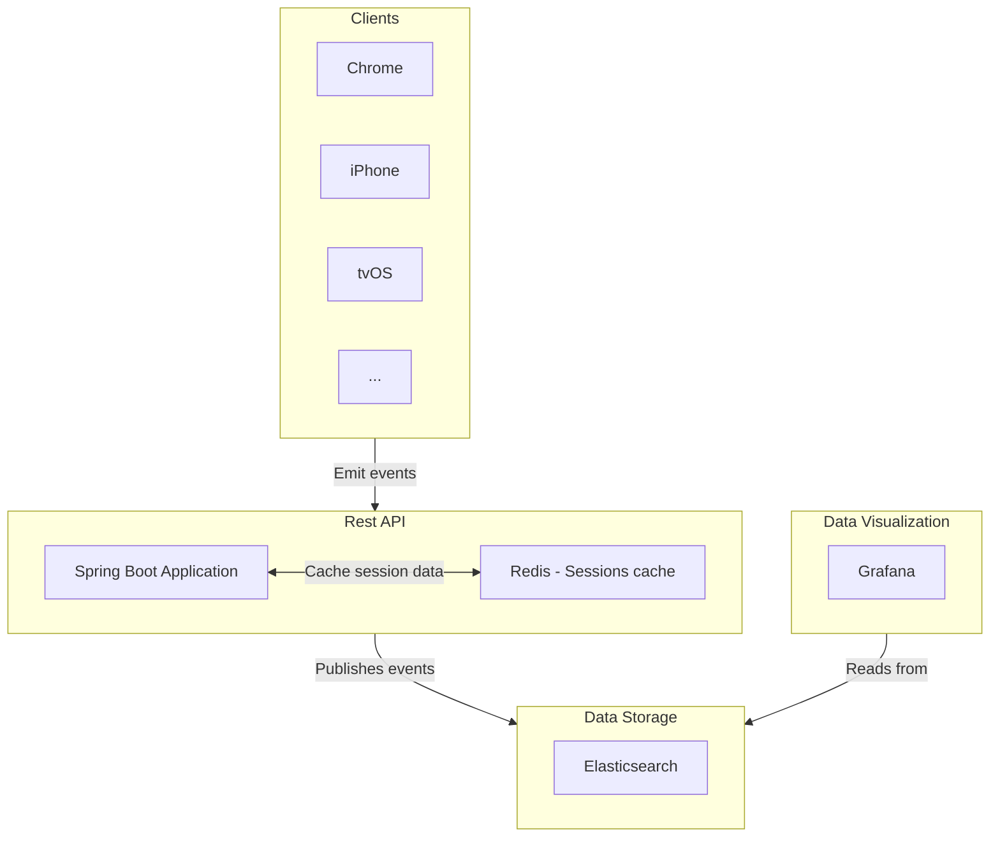

# Event Processing and Visualization System

This project provides an event processing and visualization system using a combination of Redis,
Elasticsearch, and Grafana. It allows for the reception, processing, and visualization of events in
real-time.


## Quick Guide

**Prerequisites and Requirements**

- Docker and Docker Compose installed on your machine.
- (Optional) Java 21 installed for building the REST API service individually.
- (Optional) Maven installed for building the REST API service individually.
- (Optional) Node.js to run the fixture generation script.

**Setup**

1. Build all images and start the services:
    ```bash
    docker-compose up --build
    ```

2. Visit `http://localhost:3000` to view the data and create dashboards.

3. Generate test data:
   ```bash
   cd test
   sh ./start.sh
   ```
   This script installs npm dependencies and runs 5 parallel processes to simulate player sessions
   with random values and published the events to the REST API. If you want to run a single process
   simply do:
   ```bash
   ce test
   npm install
   npm run start
   ```
   A default dashboard has already been provisioned in the grafana image to visualize this data.

## Documentation

### Architecture Diagram



### Service Descriptions

- **Clients**: Represents the sources of events such as websites and applications.

- **REST API**: Handles the reception of events and session management.
  - **Spring Boot Application**: The main application that processes incoming events, stores session
    data, and publishes events to an Elasticsearch storage.
  - **Redis**: Acts as a cache for session data, providing fast read/write access to session
    information.

- **Data Storage**: Manages the storage of events.
  - **Elasticsearch**: Stores and indexes events, providing powerful search and analytics
    capabilities.

- **Visualization**: Provides visualization of the data.
  - **Grafana**: Connects to Elasticsearch to visualize event data through dashboards.

## License

This project is licensed under the MIT License. See the LICENSE file for details.
